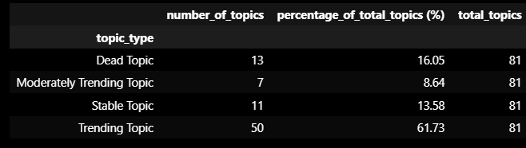

# StackOverflow Time Series Segmentation

## Goal:
This project aims to analyze StackOverflow engagement over time. The goal is to identify trending and dying topics on Stackoverflow, helping Stackoverflow business stakeholders delegate advertisement placement based on hotness of topics.

\#python \#time-series-analysis \#plotly

## Notebook Structure

If you want more information on my analysis, see Jupyter Notebook: [StackOverflow_Trend_Segmentation.ipynb](./StackOverflow_Trend_Segmentation.ipynb).

To recreate environment, run `pip install -r requirements` in your virtualenv of choice.

## What is a Topic?

A topic is a tag that categorizes a question on a StackOverflow question. For example, for the question "Python downloads empty files from S3 bucket after checking if it already exists" [Question Link](https://stackoverflow.com/questions/78766307/python-downloads-empty-files-from-s3-bucket-after-checking-if-it-already-exists), two tags "python" and "amazon-s3" are indicated below the question. 

<em>Notice the topics are circled in red</em>

## How are the Trends stored? (Dataset Information)

The dataset contains a month column, followed by 81 other columns each representing a topic on **StackOverflow**. Each of the 81 columns stores number of questions per month as values. Emphasis that numbers are aggregated on a **monthly level**.  

Here's the table format of the dataset
| Month | python | sql | ... | numpy | pandas |
| --- | --- | --- | --- | --- | --- |
| 09-Jan | 500 | 300 | ... | 1000 | 2000 |
| 09-Feb | 200 | 300 | ... | 4000 | 1000 |

<em>Disclaimer: Numbers in above table are made up, but gives you a good idea of the dataset format. In
the fake data above, we see the number of questions asked per month 
from various data science topics (python, sql, numpy and pandas) in January 2009 and February 2009</em>

The original dataset is available on Kaggle: (https://www.kaggle.com/datasets/aishu200023/stackindex/data)
In this repository, it is locateed in the root repository unde the name [MLTollsStackOverflow.csv](./MLTollsStackOverflow.csv)

## EDA
Questions Over Time Ranges from January 2009 to December 2018. Considering StackOverflow was launched on September 15, 2008, this dataset has a pretty comprehensive overview on the number of questions published in StackOverflow.

### Distribution of Number of Questions per Month

<em> A majority of topics are not popular and don't get questions asked a lot per month, as 7779 question counts per month were under 50 (~73% of all question counts per month).</em>

### Question Count Per Month Over Time Per Topic

<em> This image is cut off to save space in README. There are actually 81 topics in the dataset in total, rather than the 32 shown here.</em>

## Results

The main analysis focuses are dividing StackOverflow topics into qualitative trend score descriptions, so ads can be assigned accordingly
based on trend, a measure of hotness.

### Visualization of Trend Score

### Statistics of Trend Score

<em> We segregate the Trend Scores into Four Categories: Dead, Stable, Moderately Trending, Trending </em>

### Interpretation of Trend Score
If topics showing a clear positive trend in number of questions over time (ex. Pandas), the average question count every 6 months would only increase, thus the trend score will be 1 or close to 1.

If a topic has a trend that sometimes decreases but most of the time increases,  the trend score will be closer to 0.5. 

If the topic has completely died off in the recent and no one is asking about it on StackOverflow, the trend score will be closer to 0, because even if your average question count has increased in the past, it completely tapers off towards the end so you have a net zero gain in number of questions asked towards the end.

### Here are a Few Examples of the Topics in Different Trend Score Categories

#### Trending Topic

#### Moderately Trending Topic

#### Stable Topic

#### Dead Topic

## Conclusion

Using the trend score, we categorized trends of different topics for stackoverflow questions into four areas: "Trending", "Moderately Trending", "Stable" and "Dead". Trends data ranges from January 2009 - December 2019. Using this categorization, we are able to delegate ads based on hotness of Stackoverflow topics.

## Challenges
- "Dead Topics" topics look like a byproduct of incorrect data. Pillow and pyspark are still popular topics on stackoverflow's websites and for their numbers of questions to simply drop dead to 0 does not make any sense. Need to contact the owner of the dataset for questions on data quality.

## What could be improved?
- Delegate ads to topics based on both average number of questions in the recent 6 months and trendiness, because just looking at trendiness does not reveal how many questions are being asked in a topic, which may be more important to determine topic hotness. 

- There are many more factors that might make a topic 'hot', such as number of average clicks of questions per topic, average engagement of questions (likes/comments) per topic. Even though we don't have those features, they may correspond more to hotness than trendiness of number of questions. If those features are available, we can use them to optimize ad delegation.  
 
